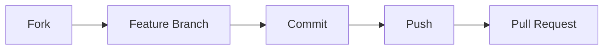

## 🧪 Test Verisi

<div align="center">
<table>
<tr>
<th> Kategoriler</th>
<th> Sample Data</th>
</tr>
<tr>
<td>

1. **Genel** - Genel haberler
2. **Spor** - Spor haberleri  
3. **Kültür** - Kültürel etkinlikler
4. **Eğitim** - Eğitim haberleri
5. **Teknoloji** - Teknoloji haberleri

</td>
<td>

- **3 örnek haber** (farklı kategorilerde)
- **2 örnek duyuru** (resimli ve resimsiz)

</td>
</tr>
</table>
</div>

##  Proje Özeti

**Dernek Etkinlik Yönetim Sistemi**, dernek üyeleri için haber ve duyuru paylaşım platformudur. Admin paneli üzerinden içerik yönetimi, kullanıcı dostu arayüz ile içerik görüntüleme ve gelişmiş arama funcionality'si sunmaktadır.

##  Teknoloji Stack

<table>
<tr>
<td valign="top" width="33%">

### 🔧 Backend
- **Java 17**
- **Spring Boot 3.1.0**
- **Spring Data JPA / Hibernate**
- **PostgreSQL 15**
- **Redis** (Cache)
- **Maven** (Dependency Management)
- **Lombok** (Code Generation)

</td>
<td valign="top" width="33%">

###  Frontend
- **React 18** + **TypeScript**
- **Vite** (Build Tool)
- **Material-UI (MUI)**
- **React Router DOM**
- **Slick Carousel**
- **Context API** (State Management)

</td>
<td valign="top" width="33%">

###  DevOps & Database
- **Docker & Docker Compose**
- **PostgreSQL** (Ana Veritabanı)
- **Redis** (Cache Layer)

</td>
</tr>
</table>

##  Ana Özellikler

<details>
<summary><b>👤 Kullanıcı Özellikleri</b></summary>

-  Haberler listeleme ve detay görüntüleme
-  Duyurular listeleme ve detay görüntüleme  
-  Gelişmiş arama functionality'si
-  Responsive (mobil uyumlu) tasarım
-  Modern carousel slider
-  Popülerlik tabanlı sorting
-  Real-time image loading

</details>

<details>
<summary><b> Admin Panel Özellikleri</b></summary>

-  **Güvenli admin girişi** (`admin/dernek123`)
-  **CRUD Operasyonları**: Oluştur, Oku, Güncelle, Sil
-  **Resim yükleme** desteği (preview ile)
-  **Zamanlanmış yayınlama** 
-  **Kategori yönetimi** (Haberler için)
-  **İstatistik görüntüleme**
-  **Dark theme** admin paneli

</details>

<details>
<summary><b> Teknik Özellikler</b></summary>

-  **Single Table Inheritance** pattern
-  **Redis Cache** entegrasyonu
-  **Responsive Design** (xs, sm, md, lg breakpoints)
-  **Global search** functionality  
-  **Input validation** ve error handling
-  **File upload** sistemi
-  **Real-time updates**
-  **LocalStorage** integration (popularite tracking)

</details>

##  Veritabanı Tasarımı

<details>
<summary><b> Single Table Inheritance Yapısı</b></summary>

```sql
-- Etkinlikler tablosu (Base entity)
CREATE TABLE etkinlikler (
    id BIGSERIAL PRIMARY KEY,
    tur VARCHAR(31) NOT NULL, -- Discriminator (HABER/DUYURU)
    konu VARCHAR(1000) NOT NULL,
    icerik TEXT NOT NULL,
    gecerlilik_tarihi TIMESTAMP,
    resim_yolu VARCHAR(255),
    kategori_id BIGINT,
    created_time TIMESTAMP DEFAULT CURRENT_TIMESTAMP,
    updated_time TIMESTAMP DEFAULT CURRENT_TIMESTAMP,
    created_by VARCHAR(100),
    updated_by VARCHAR(100),
    is_active BOOLEAN DEFAULT TRUE,
    
    -- Haber-specific fields
    haber_linki VARCHAR(500),
    
    -- Duyuru-specific fields  
    oncelik_seviyesi INTEGER DEFAULT 1,
    hedef_grup VARCHAR(200),
    
    FOREIGN KEY (kategori_id) REFERENCES kategoriler(id)
);

-- Kategoriler tablosu
CREATE TABLE kategoriler (
    id BIGSERIAL PRIMARY KEY,
    ad VARCHAR(100) NOT NULL UNIQUE
);
```

</details>

<details>
<summary><b> Entity İlişkileri</b></summary>

```
Etkinlik (Base)
├── Haber extends Etkinlik
│   ├── haberLinki: String
│   └── kategori: ManyToOne → Kategori
└── Duyuru extends Etkinlik
    ├── oncelikSeviyesi: Integer
    └── hedefGrup: String
```

</details>

##  Hızlı Başlangıç

###  Ön Gereksinimler

```bash
Java 17+
Node.js 18+
Docker & Docker Compose
Git
```

###  Kurulum

<details>
<summary><b> Projeyi Klonlayın</b></summary>

```bash
git clone <repository-url>
cd DERNEK-ETKINLIK-YONETIMI
```

</details>

<details>
<summary><b> Docker Servisleri</b></summary>

```bash
# PostgreSQL ve Redis'i başlat
docker-compose up -d

# Servis durumunu kontrol et
docker-compose ps
```

</details>

<details>
<summary><b> Backend Çalıştır</b></summary>

```bash
cd backend/etkinlik-yonetimi

# Maven dependencies'i indir
./mvnw clean install

# Spring Boot uygulamasını başlat
./mvnw spring-boot:run
```

 Backend: **http://localhost:8080**

</details>

<details>
<summary><b> Frontend Çalıştır</b></summary>

```bash
cd frontend/vite-project

# NPM dependencies'i indir
npm install

# Development server'ı başlat
npm run dev
```

 Frontend: **http://localhost:5173**

</details>

###  Admin Girişi

```
Username: admin
Password: dernek123
```

## Konfigürasyon

<details>
<summary><b> Backend Konfigürasyonu</b></summary>

```properties
# Database
spring.datasource.url=jdbc:postgresql://localhost:5433/dernek_db
spring.datasource.username=dernek_user
spring.datasource.password=dernek123

# JPA/Hibernate
spring.jpa.hibernate.ddl-auto=update
spring.jpa.show-sql=true

# Redis Cache
spring.cache.type=redis
spring.data.redis.host=localhost
spring.data.redis.port=6379

# File Upload
spring.servlet.multipart.max-file-size=10MB
file.upload-dir=uploads
```

</details>

<details>
<summary><b> Frontend Konfigürasyonu</b></summary>

```typescript
// API Base URL
const BASE_URL = "http://localhost:8080/api";

// Admin Credentials
const ADMIN_CREDENTIALS = {
    username: "admin",
    password: "dernek123"
};
```

</details>

## API Endpoints

<details>
<summary><b> Haber Endpoints</b></summary>

### Public Endpoints
```http
GET    /api/haberler                    # Aktif haberleri listele
GET    /api/haberler/{id}               # Tek haber detayı
GET    /api/haberler/search?konu=query  # Haber arama
```

### Admin Endpoints  
```http
GET    /api/haberler/admin              # Tüm haberler (admin)
POST   /api/haberler/admin              # Yeni haber oluştur
POST   /api/haberler/admin/with-image   # Resimli haber oluştur
PUT    /api/haberler/admin/{id}         # Haber güncelle
PUT    /api/haberler/admin/{id}/with-image # Resimli haber güncelle
DELETE /api/haberler/admin/{id}         # Haber sil
```

</details>

<details>
<summary><b> Duyuru Endpoints</b></summary>

### Public Endpoints
```http
GET    /api/duyurular                   # Aktif duyuruları listele  
GET    /api/duyurular/{id}              # Tek duyuru detayı
GET    /api/duyurular/search?konu=query # Duyuru arama
```

### Admin Endpoints
```http
GET    /api/duyurular/admin             # Tüm duyurular (admin)
POST   /api/duyurular/admin             # Yeni duyuru oluştur
POST   /api/duyurular/admin/with-image  # Resimli duyuru oluştur  
PUT    /api/duyurular/admin/{id}        # Duyuru güncelle
PUT    /api/duyurular/admin/{id}/with-image # Resimli duyuru güncelle
DELETE /api/duyurular/admin/{id}        # Duyuru sil
```

</details>

## UI/UX Özellikleri

<table align="center">
<tr>
<td align="center">

### Renk Paleti
- **Primary:** `#b5a174` (Altın/Bronz)
- **Secondary:** `#d4c49a` (Açık Altın)  
- **Background:** `#121212` (Koyu Siyah)
- **Paper:** `#1e1e1e` (Koyu Gri)
- **Text:** `#ffffff` / `#b0b0b0`

</td>
<td align="center">

### Responsive Breakpoints
- **xs:** 0px+ (Mobile)
- **sm:** 600px+ (Tablet)  
- **md:** 900px+ (Desktop)
- **lg:** 1200px+ (Large Desktop)

</td>
</tr>
</table>

<div align="center">

### Component Library
**Material-UI Cards** • **Slick Carousel** • **MUI Dialogs** • **Snackbar** • **Fab Button**

</div>

## Güvenlik

<table>
<tr>
<td width="50%">

### Authentication
- **Role-based** access control
- **Protected routes** (admin paneli)
- **LocalStorage** session management
- **CORS** configuration

</td>
<td width="50%">

### Admin Panel Erişimi
```
Username: admin
Password: dernek123
```

</td>
</tr>
</table>

## Proje Yapısı

<details>
<summary><b> Klasör Ağacı</b></summary>

```
DERNEK-ETKINLIK-YONETIMI/
│
├── backend/etkinlik-yonetimi/          # Spring Boot Backend
│   ├── src/main/java/com/dernek/etkinlik_yonetimi/
│   │   ├──  config/                     # Redis, Static File Config
│   │   ├──  controller/                 # REST Controllers
│   │   ├──  dto/                        # Request/Response DTOs
│   │   ├──  entity/                     # JPA Entities
│   │   ├──  exception/                  # Global Exception Handler
│   │   ├──  mapper/                     # Entity-DTO Mappers
│   │   ├──  repository/                 # JPA Repositories
│   │   ├──  service/                    # Business Logic
│   │   └──  EtkinlikYonetimiApplication.java
│   ├── src/main/resources/
│   │   ├──  application.properties      # Configuration
│   │   └──  data.sql                    # Initial Data
│   └──  pom.xml                        # Maven Dependencies
│
├──  frontend/vite-project/              # React Frontend
│   ├── src/
│   │   ├──  api/                       # API Service Functions
│   │   ├──  auth/                      # Authentication Context
│   │   ├──  components/                # Reusable Components
│   │   ├──  models/                    # TypeScript Interfaces
│   │   ├──  pages/                     # Page Components
│   │   ├──  assets/                    # Static Assets
│   │   ├──  App.tsx                    # Main App Component
│   │   └──  main.tsx                   # Entry Point
│   ├──  package.json                   # NPM Dependencies
│   └──  vite.config.ts                 # Vite Configuration
│
├──  init-db/                           # Database Initialization
│   └──  01-init.sql                    # Database Setup Script
│
├──  uploads/                           # File Upload Directory
├──  docker-compose.yml                 # Docker Services
└──  README.md                          # Documentation
```

</details>


##  Katkıda Bulunma

<div align="center">



</div>

1. **Fork'layın** - Projeyi kendi hesabınıza fork'layın
2. **Feature branch** - `git checkout -b feature/AmazingFeature`
3. **Commit** - `git commit -m 'Add some AmazingFeature'`
4. **Push** - `git push origin feature/AmazingFeature`
5. **Pull Request** - GitHub'da pull request açın

---


**Modern web geliştirme teknikleri ve best practice'ler kullanılarak geliştirilmiştir.**

</div>

# GÖRÜNÜM AŞAĞIDAKİ GİBİ OLMALIDIR


Lisans

Bu proje MIT Lisansı ile lisanslanmıştır.
